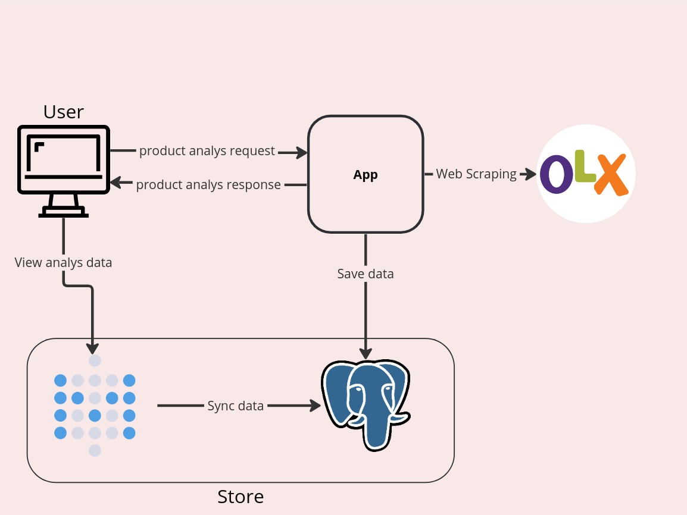

# Webhook

> This project consists of an endpoint to consume webhooks of Pull Request from github and send notifications in specific chats.
<p align="center">
  
</p>

### Platforms already integrated
</code>


----
## Architecture
<p align="center">
  
</p>

## Built With


### Pre-requisites
* go
  ```sh
  sudo snap install go --classic
  ```
* mongoDB

### Installation
1. Clone the repository
   ```sh
   git clone https://github.com/victorvcruz/social_network_project.git
   ```
2. Install go packages
   ```sh
   go mod download
   ```

## Usage
> Add your url in Repository->Setting->Webhook
<p align="center">
  
</p>

* Insert your platform chat and your environment variables in `.env`

### To start execution
* run
   ```sh
   go run main.go
   ```

